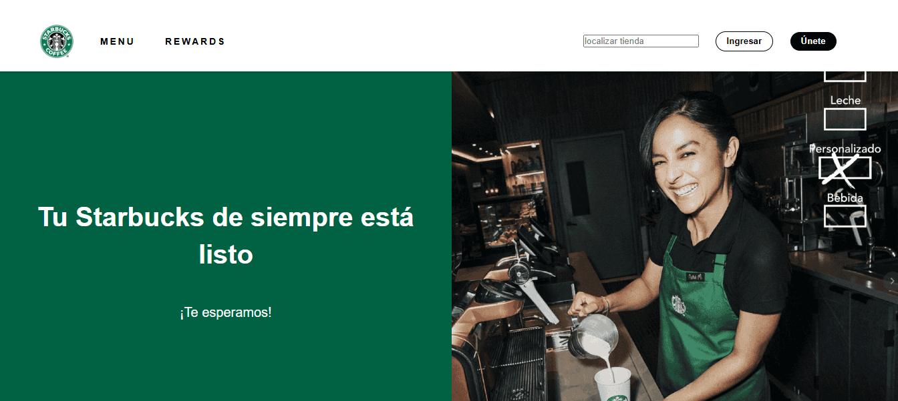
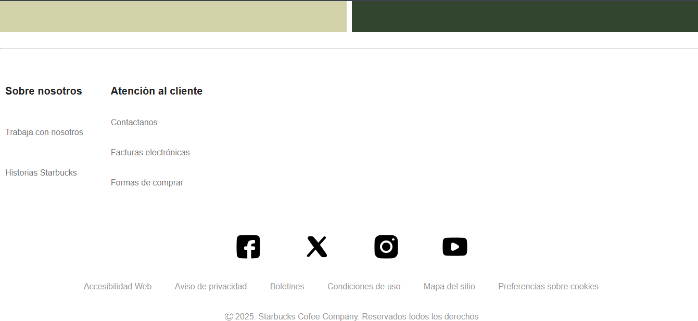

# ☕ Starbucks Landing Page Clone (Responsive Design)

## 🌟 Resumen del Proyecto

Este es un clon de la página de inicio de Starbucks para demostrar sólidas habilidades en **Diseño Responsivo**, **CSS Layout** y **Buenas Prácticas** de *Front-End*.

El objetivo principal fue replicar fielmente la experiencia de usuario y la estructura visual del sitio original, asegurando que el diseño se adapte perfectamente a cualquier dispositivo (móvil, tableta y escritorio).

---

## 🛠️ Tecnologías Utilizadas

* **HTML5:** Estructura semántica y accesible.
* **CSS3:** Estilizado completo, incluyendo variables CSS (`:root`) para manejo de temas y colores.
* **CSS Grid:** Utilizado para la **macroestructura** del layout (header y secciones principales).
* **Flexbox:** Utilizado para la **microestructura** y alineación de elementos de navegación y footer.

---

## ✨ Características Destacadas y Habilidades Demostradas

Este proyecto destaca las siguientes técnicas profesionales:

1.  **Layout Shifter (Menú Adaptativo):** El menú principal se transforma en un **icono de hamburguesa** en dispositivos móviles, demostrando el patrón de diseño *Layout Shifter*.
2.  **Estrategia Desktop First:** El código CSS está optimizado utilizando `max-width` para transicionar de un diseño de escritorio complejo a una vista móvil limpia y apilada.

3.  **Manejo de Layouts Complejos:** Implementación de `grid-template-columns: auto 1fr;` en el *header* para separar el logo y el menú de manera eficiente.
4.  **Control de Flujo con `order`:** Uso de la propiedad `order` en las Media Queries para **invertir el orden visual** de los bloques de imagen y texto en móvil, garantizando una lectura lógica sin alterar el HTML.
5.  **Accesibilidad (ARIA):** Inclusión de atributos básicos de accesibilidad (`alt` en imágenes) y preparación del HTML para una futura implementación de JavaScript.

---

## 🌐 Visualización del Proyecto

**Estado:** Actualmente en desarrollo (solo HTML/CSS). La interactividad (JavaScript) se añadirá en la próxima fase.

Para ver el diseño y las funcionalidades responsivas (Layout Shifter):

1. **Clona** el repositorio a tu máquina local.
2. Abre el archivo **`index.html`** en tu navegador.
3. Utiliza las **Herramientas de Desarrollador** de tu navegador (F12) para inspeccionar y cambiar los tamaños de pantalla.

## 📧 Contacto

* **Tu Nombre:** [Huguette López]
* **LinkedIn:** [www.linkedin.com/in/huguettea134711a3]

---