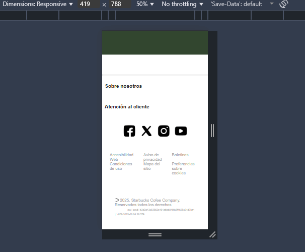

# ☕ Starbucks Landing Page Clone (Responsive Design)

## 🌟 Resumen del Proyecto

Rehice la página de inicio de Starbucks para demostrar sólidas habilidades en **Diseño Responsivo**, **CSS Layout** y **Buenas Prácticas** de *Front-End*.

Mi objetivo fue replicar la experiencia de usuario y la estructura visual del sitio original, haciéndolo un diseño responsivo que se adapta a cualquier dispositivo: móvil, tableta y escritorio.

---

## 🛠️ Tecnologías Utilizadas

* **HTML5:** para estructura semántica.
* **CSS3:** para estilizar, usando variables CSS (`:root`) para manejo de temas y colores.
* **CSS Grid:** para la **macroestructura** del layout (header y secciones principales).
* **Flexbox:** para la **microestructura** y alineación de elementos de navegación y footer.

---

## ✨ Características Destacadas y Habilidades Demostradas:

1.  **Layout Shifter (Menú Adaptativo):** Al usar un móvil el menú principal se transforma en un **icono de hamburguesa**.
2.  **Estrategia Desktop First:** En el código CSS usé `max-width` para pasar de un diseño de escritorio a una vista móvil apilada.

3.  **Manejo de Layouts Complejos:** usé `grid-template-columns: auto 1fr;` en el *header* para separar el logo y el menú.
4.  **Control de Flujo con `order`:** Usé la propiedad `order` en las Media Queries para **invertir el orden visual** de los bloques de imagen y texto en móvil, garantizando una lectura lógica sin alterar el HTML.
5.  **Accesibilidad (ARIA):** usé atributos básicos de accesibilidad (`alt` en imágenes) y preparé el HTML para cuando le incluya JavaScript.

---

## 🌐 Visualización del Proyecto

**Estado:** Actualmente en desarrollo (solo HTML/CSS). La interactividad (JavaScript) se añadirá en la próxima fase.

## 📧 Contacto

Huguette López
* **LinkedIn:** [www.linkedin.com/in/huguettea134711a3]

---

